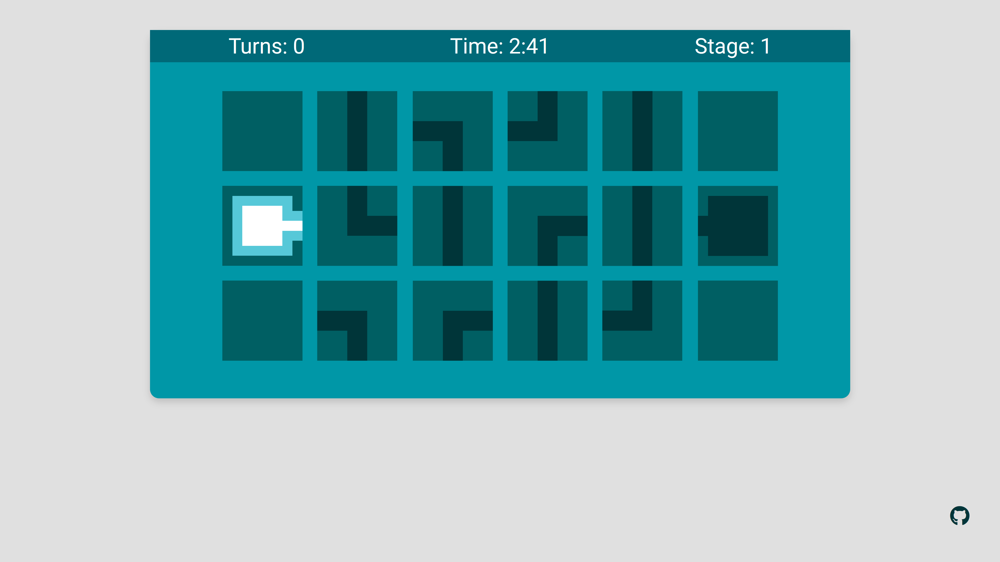
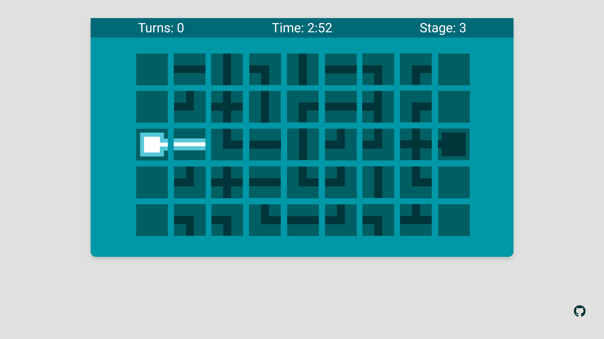
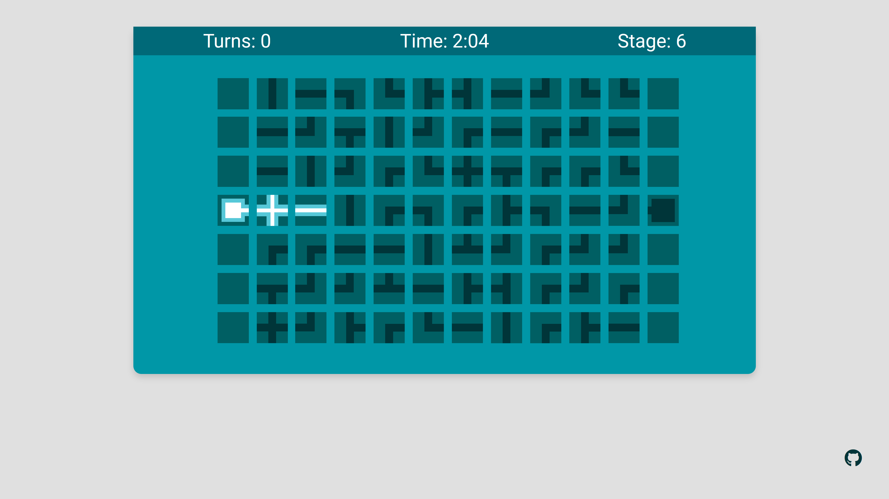
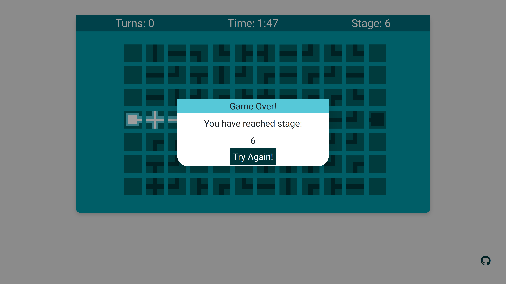

# Pipe Puzzle Game

You need to build a path between the start and end point. You can rotate
each tile with a mouse click. There a three different difficulties. After solving
each stage you gain time corresponding to your turns needed.

# Node/Express setup with React

This application contains a simple Node.js server delivering a plain
HTML file on http://localhost:8080/.

The application comes with a Node and Express Backend which functionality
is specified in the **server.js**.

The React-Components are defined in **src/js/components** and the 'normal'
js can be found in **src/js**.

The js files using ES6 and JSX content needs to be parsed before use. You can
find the parsed js files in **/build/js**. 

# Guide

### 1. Make shure you have [Node.js](https://nodejs.org/en/) installed
### 2. Open the Project in your IDE
### 3. Install all NPM packages

NPM is a package manager and will automatically install all dependencies of this project.
So type this command in your console when your'e in the directory of this project:

    npm install
    
### 4. Start Babel and Browserify watching over your src folder

If you want to use JSX (JavaScriptXML) with React you need to make
Babel translate it to valid JS. Also js files are merged into one
using Browserify. 
You have to execute the following script each time you start up the project:

    npm run watch
    
Now your js files in the src folder will be found translated in your /build/js folder.
Babel will automatically compile as you make changes to your files as it now watching you!

### 5. Start up the server

To start up the server you just need to execute:

    npm start
    
Now you can go to http://localhost:8080/ and play the game.

### (Optional) Run the tests

To run all test written in the directory **/test** run the following command

    npm run test
    
Tests include React Snapshot-Tests, which pre-render React Components.
If something changed the tests will fail, if you changed the Components
by purpose, you can run the following command to update the tests.
    
    jest --updateSnapshot

### (Optional) Minify your JS

The size of the main js file **build/js/app.deploy.js** is quite large so you
can minify the file and reduce its size by the following command:

    npm run minify
    
The minified js file can be found in **build/minified/js/app_deploy.min.js**.
You have to change the reference in **src/html/app.html** to the new js file.